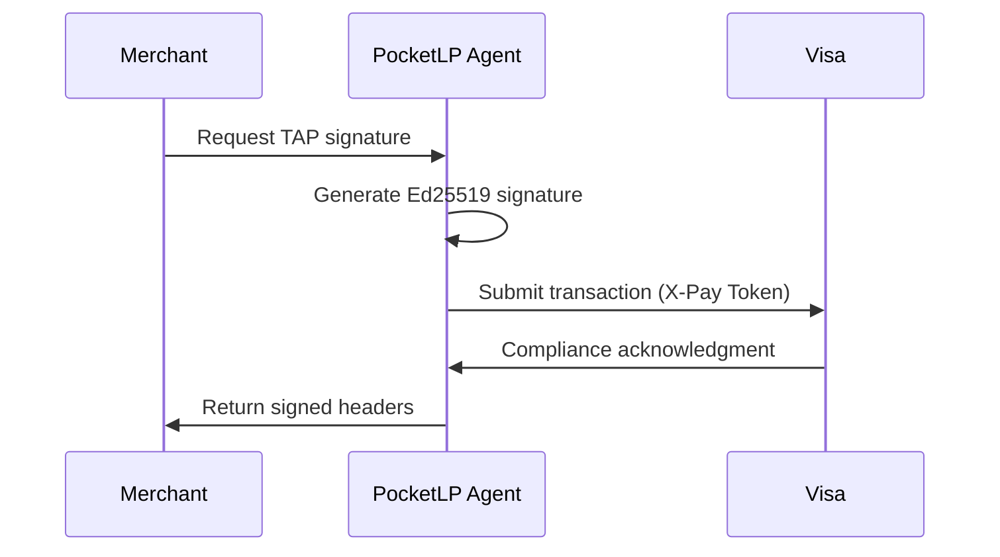
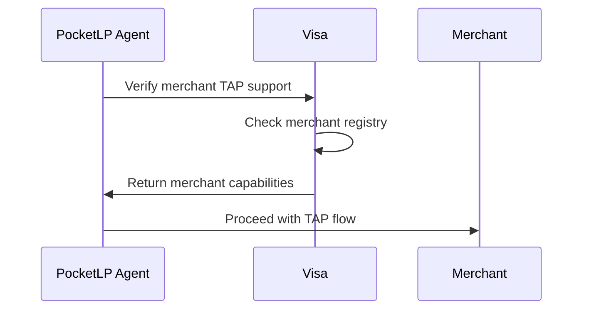

# Visa TAP Integration Guide

## ✅ **Integration Complete!**

Your PocketLP TAP Agent now has full Visa Trusted Agent Protocol integration with X-Pay Token authentication.

## 🏦 **Visa Developer Setup**

### Step 1: Get X-Pay Token Credentials

1. Go to [Visa Developer Center](https://developer.visa.com)
2. Navigate to your project → **Credentials**
3. Click **"ADD X-PAY TOKEN"**
4. Save your credentials:
   - `API Key` → Use as `VISA_API_KEY`
   - `Shared Secret` → Use as `VISA_SHARED_SECRET`

### Step 2: Configure Environment

```bash
# Add to your .env file
VISA_API_KEY=your_x_pay_token_api_key_here
VISA_SHARED_SECRET=your_shared_secret_here
VISA_SANDBOX=true  # Set to false for production
```

## 🚀 **Available Endpoints**

### JWKS Discovery (Required by Visa)
```
GET https://your-domain/.well-known/jwks
```
Returns public keys for signature verification

### Visa Registration
```bash
# Register agent with Visa TAP
curl -X POST http://localhost:4001/api/visa/register

# Check registration status
curl http://localhost:4001/api/visa/status
```

### Merchant Verification
```bash
# Verify if merchant supports TAP
curl -X POST http://localhost:4001/api/visa/verify-merchant \
  -H "Content-Type: application/json" \
  -d '{"merchantUrl": "https://example-merchant.com"}'
```

### Transaction Submission
```bash
# Submit transaction to Visa for compliance
curl -X POST http://localhost:4001/api/visa/submit-transaction \
  -H "Content-Type: application/json" \
  -d '{
    "merchantId": "merchant123",
    "amount": 25.50,
    "currency": "USD",
    "signature": "your_tap_signature"
  }'
```

### Compliance Monitoring
```bash
# Get compliance report
curl http://localhost:4001/api/visa/compliance
```

## 🔧 **Integration Features**

### ✅ X-Pay Token Authentication
- Automatic HMAC-SHA256 signing for Visa API calls
- Token verification for incoming webhooks
- Proper timestamp validation and replay protection

### ✅ TAP Compliance
- RFC 9421 HTTP Message Signatures
- Ed25519 key management
- JWKS discovery endpoint
- Agent metadata publishing

### ✅ Merchant Support
- TAP-enabled merchant verification
- Signature validation for merchants
- Consumer recognition objects
- Payment container handling

### ✅ Monitoring & Compliance
- Real-time compliance scoring
- Transaction submission tracking
- Agent status monitoring
- Automated health checks

## 🔄 **Integration Workflow**

### 1. Development Setup
```bash
# Start TAP agent with Visa integration
cd tap-agent
npm run dev

# Agent will show Visa status on startup
```

### 2. Register with Visa
```bash
# Register your agent
curl -X POST http://localhost:4001/api/visa/register
```

### 3. Test Integration
```bash
# Check status
curl http://localhost:4001/api/visa/status

# Test JWKS discovery
curl http://localhost:4001/.well-known/jwks

# Test agent metadata
curl http://localhost:4001/.well-known/tap-agent
```

## 📊 **Monitoring Dashboard**

The TAP agent provides real-time monitoring:

- **Agent Status**: Registration and compliance status
- **Transaction Volume**: Real-time transaction processing
- **Compliance Score**: Visa compliance rating
- **Error Rates**: Failed transactions and causes

## 🛡️ **Security Features**

### Key Management
- Ed25519 signatures for TAP authentication
- Secure key storage and rotation support
- Public key discovery via JWKS

### API Security
- X-Pay Token authentication for all Visa API calls
- Request signing with HMAC-SHA256
- Timestamp validation and nonce protection
- Rate limiting and request validation

### Compliance
- Automatic transaction logging
- Signature verification
- Merchant validation
- Real-time compliance monitoring

## 🔗 **Agent Communication**

### TAP Signature Flow


### Merchant Verification Flow


## 📈 **Production Deployment**

### Environment Configuration
```bash
# Production settings
VISA_SANDBOX=false
VISA_API_KEY=production_api_key
VISA_SHARED_SECRET=production_shared_secret
NODE_ENV=production
```

### Health Monitoring
```bash
# Health check endpoint
curl http://localhost:4001/.well-known/health

# Visa API health
curl http://localhost:4001/api/visa/status
```

## 🎯 **Next Steps**

1. **Get Visa Credentials**: Set up X-Pay Token in Visa Developer Center
2. **Register Agent**: Call `/api/visa/register` endpoint
3. **Test Merchants**: Verify TAP-enabled merchants
4. **Monitor Compliance**: Check `/api/visa/compliance` regularly
5. **Production Deploy**: Switch to production Visa endpoints

## 📞 **Support & Resources**

- **Visa Developer Docs**: [developer.visa.com](https://developer.visa.com)
- **TAP Specification**: RFC 9421 HTTP Message Signatures
- **Agent Metadata**: `/.well-known/tap-agent`
- **JWKS Discovery**: `/.well-known/jwks`

---

**🎉 Your PocketLP agent is now fully integrated with Visa's Trusted Agent Protocol!**

The system supports production-grade TAP compliance with X-Pay Token authentication, making your round-up agent ready for real merchant interactions.